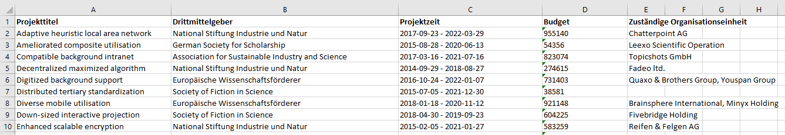

# Bericht zu Transparenzrichtlinie

Bericht zu Transparenzrichtlinie beinhaltet folgende Anagben:

- Drittmittelprojekt

- Fördermittelgeber

- Bewilligungssumme

- zuständige Organisationseinheit

## Anleitung in 3 Schritten: Wie erstelle ich einen Bericht mit Vitro Query Tool?
## Data Distributors
**Wichtig: Die Namen des Data Distributor dürfen keine Leerzeichen enthalten!

###Schritt 1: Select from Content Distributor
Um die Daten für den Bericht zu erhalten, wird ein *Select from Content Distributor* angelegt. Dieses enthält Bedingungen, den die Daten entsprechen sollen. 
Tragen Sie den Namen des Distributor - z. B. *Transparenzrichtlinie* in das Feld *Action name* ein.
Die Kategorie - <http://vivoweb.org/ontology/core#Grant> wird für die Abbildung der Drittmittelprojekte verwendet. Anstelle von <http://vivoweb.org/ontology/core#Grant> kann eine lokale Drittmittelprojekt-Kategorie, falls vorhanden, verwendet werden. Anstelle von <http://vivoweb.org/ontology/core#totalAwardAmount> kann auch eine entsprechende Datatype Property aus der lokalen Ontologie eingesetzt werden, um die Bewilligungssumme abzubilden.
Über die Rolle <http://vivoweb.org/ontology/core#AdministratorRole>, die im VIVO als Kontextknoten zwischen dem Projekt und der Organisationeinheit dient, wird die zuständige Organisationseinheit ermittelt. Auch an dieser Stelle können lokal definierte Rollen eingesetzt werden.
Die Funktion *Group(concat(distinct ?orgLabel ; Separator = ",")As ?orgUnit)* dient der Zusammenfassung aller für ein Projekt zuständigen Organisationseinheiten in einer Spalte. 
```
Select  (MIN(?label) AS ?projekttitel) ?funderLabel   ?projektzeit ?budget   (Group_Concat ( distinct ?orgLabel ; Separator = ", ")As ?orgUnit)  
Where {
 ?projekt a <http://vivoweb.org/ontology/core#Grant> .
 ?projekt <http://www.w3.org/2000/01/rdf-schema#label> ?label .
 ?projekt <http://vivoweb.org/ontology/core#totalAwardAmount> ?tam. 
  Bind(str(?tam)AS ?budget)

   
  Optional { 
  ?projekt <http://vivoweb.org/ontology/core#assignedBy> ?funder .
  ?funder <http://www.w3.org/2000/01/rdf-schema#label> ?funderl .
  Bind(str(?funderl)AS ?funderLabel) 
  }
  
  Optional { 
  ?projekt <http://vivoweb.org/ontology/core#relates> ?org .
  ?org <http://purl.obolibrary.org/obo/RO_0000053> ?adminRole .
  ?adminRole a <http://vivoweb.org/ontology/core#AdministratorRole> .
  ?org <http://www.w3.org/2000/01/rdf-schema#label> ?orgLabel1.
  Bind((?orgLabel1) As ?orgLabel)
  }

  ?projekt <http://vivoweb.org/ontology/core#dateTimeInterval> ?dti .
  ?dti <http://vivoweb.org/ontology/core#end> ?end .
  ?dti  <http://vivoweb.org/ontology/core#start> ?start .
  ?start <http://vivoweb.org/ontology/core#dateTime> ?startdate .
  Bind(SUBSTR(str(?startdate), 1,10) as ?begin) 
  ?end <http://vivoweb.org/ontology/core#dateTime> ?enddate .
  Bind(SUBSTR(str(?enddate), 1,10) as ?ende)
  Bind(concat (?begin, ' - ', ?ende)AS ?projektzeit) 

   

 }
Group by ?projekttitel ?funderLabel ?projektzeit ?budget ?orgUnit
Order by ?projekttitel
```
### Schritt 2: Report erstellen 
Die Verwaltung von den Reports findet unter http://vivo.../.../admin/reporting statt.

Wählen Sie die Option Excel Template und klicken Sie auf Add Report.
In dem Menu Excel Template benennen Sie den Report - z. B. Transparenzrichtlinie.
Wählen Sie den entsprechenden Distributor: *Transparenzrichtlinie* aus. Vergeben Sie den Ausgangsnamen: *Transparenzrichtlinie*. Der Ausgangsname muss dem im Template definiertem Namensbereich entsprechen.  
Laden Sie die [Excel-Vorlage]() hoch.                              
Im Template dient jeweils die Variable aus der Abfrage plus .value - z. B. *${orgUnit.value}* als Pfad. Neben dem Namensbereich zum jeweiligen Wert und Output, wird in diesem Template auch der Namensbereich für die Kopfzeile definiert.

