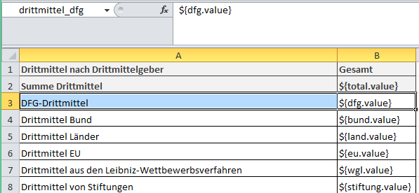

# Drittmittelbewilligungen nach Mittelgeber*innen

Regelmäßige Auswertung im Berichtswesen – Übersicht zu laufenden Drittmittelbewilligungen nach Mittelgeber*innen je Berichtsjahr.

Wichtig: Hier handelt es sich um Drittmittelbewilligungen und nicht um Drittmittelerträge. Die jeweiligen Drittmittel werden dem Berichtsjahr zugeordnet in dem das Projekt bewilligt wurde.
Berichtsanforderungen:

-	Je Berichtsjahr
-	Ausgabe nach Mittelgeber: 
	- Deutsche Forschungsgemeinschaft (DFG), 
	- Deutscher Akademischer Austauschdienst (DAAD), 
	- Bund,
	- Land,
	- Stiftungen,
	- Leibniz-Wettbewerbsverfahren
	- (…)
- Berechnung Gesamtsumme

# Anleitung in 4 Schritten: Wie erstelle ich den Bericht mit Vitro Query Tool?

## Data Distributors 
Um die Daten für den Bericht zu erhalten, wird zunächst ein Subset von Daten mittels eines *Construct Query Graph Builder* Distributor aus Gesamtbestand extrahiert. *Construct Query Graph Builder* Distributor enthält Bedingungen, den die Daten entsprechen sollen. Anschließend wird mittels des *Select from Graph Distributors* die Summe des jeweiligen Budgets aus dem zuvor gebildeten Subset abgefragt.

### Schritt 1: Construct Query Graph Builder
Die Abfrage bezieht sich auf das bewillgte Budget der Projekte, die in einem bestimmten Jahr gestartet sind. Hierzu dient (für das Jahr 2020) die Filterbedingung FILTER (STRSTARTS(str(?startdate), "2020")). Es werden die Budgets der Projekte zusammen mit den Informationen zu dem jeweiligen Drittmittelgeber abgerufen.

Anstelle von <http://vivoweb.org/ontology/core#Grant> kann eine lokale Drittmittelprojekt-Kategorie, falls vorhanden, verwendet werden. Anstelle von <https://local.ontology/local-vivo#budgetLocal> soll eine entsprechende Datatype Property aus der lokalen Ontologie eingesetzt werden.
```
Construct { 
?project a <http://vivoweb.org/ontology/core#Grant> .
 ?project <http://www.w3.org/2000/01/rdf-schema#label> ?label .
 ?project <https://local.ontology/local-vivo#budgetLocal> ?budget.
 ?project <http://vivoweb.org/ontology/core#assignedBy> ?funder .
  ?funder <http://vivoweb.org/ontology/core#assigns> ?project .
  ?funder a ?type.
  ?project <http://vivoweb.org/ontology/core#dateTimeInterval> ?dti .
  ?dti <http://vivoweb.org/ontology/core#end> ?end .
  ?dti  <http://vivoweb.org/ontology/core#start> ?start .
?start <http://vivoweb.org/ontology/core#dateTime> ?startdate .
?end <http://vivoweb.org/ontology/core#dateTime> ?enddate .
}

Where {
 ?project a <http://vivoweb.org/ontology/core#Grant> .
 ?project <http://www.w3.org/2000/01/rdf-schema#label> ?label .
 ?project <https://local.ontology/local-vivo#budgetLocal> ?budget.
 ?project <http://vivoweb.org/ontology/core#assignedBy> ?funder .
   ?funder <http://vivoweb.org/ontology/core#assigns> ?project .
  ?funder a ?type.
  ?project <http://vivoweb.org/ontology/core#dateTimeInterval> ?dti .
  ?dti <http://vivoweb.org/ontology/core#end> ?end .
  ?dti  <http://vivoweb.org/ontology/core#start> ?start .
?start <http://vivoweb.org/ontology/core#dateTime> ?startdate .
?end <http://vivoweb.org/ontology/core#dateTime> ?enddate .
 FILTER (STRSTARTS(str(?startdate), "2020"))
}
```
### Schritt 2: Konfiguration der Select from Graph Distributors 
Für die Gesamtsumme der Drittmittel im Jahr und für jeden Drittmittelgeber wird jeweils ein separater *Select from Graph* Distributor angelegt.

#### Select from Graph Distributor für die Gesamtsumme "drittmittel_total"
Wählen Sie bei der Erstellung die Option *Select from Graph Distributor*.
```
Select 
(sum ( ?budget) as ?total)

Where {
  	
    ?project a <http://vivoweb.org/ontology/core#Grant> .
    ?project <https://local.ontology/local-vivo#budgetLocal> ?budget.
 	?project <http://vivoweb.org/ontology/core#assignedBy> ?funder .
 	 
 	
}
```
#### Select from Graph Distributor "drittmittel_dfg"
Wählen Sie bei der Erstellung die Option *Select from Graph Distributor*. Ersetzen Sie <http://your.vivo/data/dfg_uri_here> durch die URI der Instanz für DFG aus Ihrem VIVO.

```
Select
(sum ( ?budget_dfg) as ?dfg)

Where 
{
?project_dfg a <http://vivoweb.org/ontology/core#Grant> .
?project_dfg <http://vivoweb.org/ontology/core#assignedBy> <http://your.vivo/data/dfg_uri_here> . # An dieser Stelle muss die URI der DFG-Instanz aus Ihrem VIVO eingesetzt werden.
?project_dfg <https://local.ontology/local-vivo#budgetLocal> ?budget_dfg.
}

```
#### Select from Graph Distributor "drittmittel_bund"
Wählen Sie bei der Erstellung die Option *Select from Graph Distributor*. Ersetzen Sie <http://your.vivo/data/bmbf_uri_here>, <http://your.vivo/data/bmg_uri_here>, <http://your.vivo/data/bmwi_uri_here> durch die URI der Instanzen für Bundesministerien aus Ihrem VIVO. Die Liste der Bundesministerien in *Value {}* kann je nach Bedarf erweitert bzw. gekürzt werden.

```
Select 
(sum ( ?budget_bund) as ?bund)

Where 
{
  ?project_bund a <http://vivoweb.org/ontology/core#Grant> .
  ?project_bund <http://vivoweb.org/ontology/core#assignedBy> ?funder_bund . 
  Values ?funder_bund {<http://your.vivo/data/bmbf_uri_here> <http://your.vivo/data/bmg_uri_here> <http://your.vivo/data/bmwi_uri_here>}. # An dieser Stelle müssen die URIs der Ministerien aus Ihrem VIVO eingesetzt werden.
  ?project_bund <https://local.ontology/local-vivo#budgetLocal> ?budget_bund.
}
```
#### Select from Graph Distributor "drittmittel_eu"
Wählen Sie bei der Erstellung die Option *Select from Graph Distributor*. Ersetzen Sie <http://your.vivo/data/eu_uri_here> durch die URI der Instanz für EU aus Ihrem VIVO.

```
Select
(sum ( ?budget_eu) as ?eu)

Where 
{
    ?project_eu a <http://vivoweb.org/ontology/core#Grant> .
 	?project_eu <http://vivoweb.org/ontology/core#assignedBy> <http://your.vivo/data/eu_uri_here> . # An dieser Stelle muss die URI der EU-Instanz aus Ihrem VIVO eingesetzt werden.
  	?project_eu <https://local.ontology/local-vivo#budgetLocal> ?budget_eu.
}
```
#### Select from Graph Distributor "drittmittel_land"
Wählen Sie bei der Erstellung die Option *Select from Graph Distributor*. Ersetzen Sie <http://your.vivo/data/mwk_uri_here> durch die URI der Instanz für eines der Landesministerien aus Ihrem VIVO. Wenn Sie mehrere Landesministerien einsetzen wollen, benutzen Sie die *Value {URI1 URI2 usw.}*

```
Select
(sum ( ?budget_land) as ?land)

Where 
{
	?project_land a <http://vivoweb.org/ontology/core#Grant> .
 	?project_land <http://vivoweb.org/ontology/core#assignedBy> <http://your.vivo/data/mwk_uri_here> . # An dieser Stelle muss die URI des Landesministerium-Instanz aus Ihrem VIVO eingesetzt werden.
  	?project_land <https://local.ontology/local-vivo#budgetLocal> ?budget_land.
}
```
#### Select from Graph Distributor "drittmittel_wgl"
Wählen Sie bei der Erstellung die Option *Select from Graph Distributor*. Ersetzen Sie <http://your.vivo/data/wgl_uri_here> durch die URI der Instanz für die Leibniz-Gemeinschaft aus Ihrem VIVO. 

```
Select
(sum ( ?budget_wgl) as ?wgl)

Where 
{
	?project_wgl a <http://vivoweb.org/ontology/core#Grant> .
 	?project_wgl <http://vivoweb.org/ontology/core#assignedBy> <http://your.vivo/data/wgl_uri_here> . # An dieser Stelle muss die URI der Instanz für die Leibniz-Gemeinschaft aus Ihrem VIVO eingesetzt werden.
  	?project_wgl <https://local.ontology/local-vivo#budgetLocal> ?budget_wgl.
}
```
#### Select from Graph Distributor "drittmittel_stiftung"
Wählen Sie bei der Erstellung die Option *Select from Graph Distributor*. 

```
Select
(sum ( ?budget_stiftung) as ?stiftung)

Where 
{
	?project_stiftung a <http://vivoweb.org/ontology/core#Grant> .
 	?project_stiftung <http://vivoweb.org/ontology/core#assignedBy> ?funder_stiftung .
    ?funder_stiftung a <http://vivoweb.org/ontology/core#Foundation> .
    ?project_stiftung <https://local.ontology/local-vivo#budgetLocal> ?budget_stiftung  .
    
}
```
### Schritt 3: Report erstellen 
Die Verwaltung von den Reports findet unter http://vivo.../.../admin/reporting statt.

Wählen Sie die Option Excel Template und klicken Sie auf Add Report.
In dem Menu Excel Template benennen Sie den Report - z. B. Drittmittel2020.
Wählen Sie für jeden Drittmittelgeber, der in Tabelle vorkommt, den entsprechenden Distributor: drittmittel_total, drittmittel_dfg, drittmittel_bund usw.. Vergeben Sie jeweils einen Ausgangsnamen: drittmittel_total, drittmittel_dfg, drittmittel_bund usw.
Legen Sie die Reihenfolge der Ausgabe-Elemente, wie diese in Ihrem Bericht angezeigt werden sollen, mittels des Ranks fest. 
Laden Sie die [Excel-Vorlage](https://github.com/VIVO-DE/reporting-marketplace/blob/main/Bericht%20zu%20den%20Drittmitteln%20nach%20Mittelgebern/drittmittel.xlsx) hoch.

In der Excel-Vorlage für diesen Bericht sind die Zellen / Bereiche für den jeweiligen Drittmittelgeber und die Summe entsprechend dem Output-Namen genannt.

Als Pfad zur Ausgabe der Werte dient jeweils die Variable aus der Abfrage plus .value - z. B. *${dfg.value}*.


